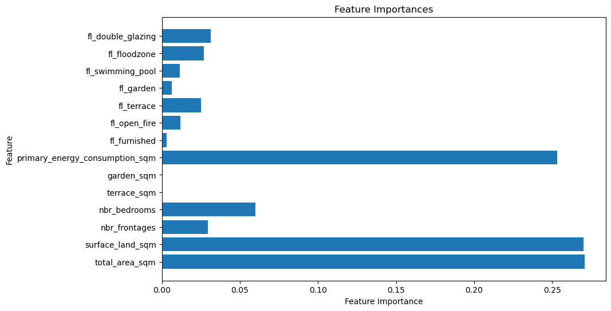

# immo-eliza-ml Machine Learning Model 

## Description

Immo Eliza ml is a machine learning model to predict prices of real estate properties in Belgium. After scraping, cleaning and analysing we have a dataset with around 75500 records and around 30 properties. This project is about trying and testing various different models to predict the price and select the best model. Train the model and display the predicted prices.

## Dataset House/Apartment Split
I split the dataset y "ImmoEliza" by 'Property Type' into "House with m = 39255" & "Apartment with m = 36256". For the puprose of this project I used only the House Dataset to avoid aggregation bias and loosing particular specifity by property type (e.g. surface area sqm only applies to houses). 

In addition the house dataset includes information like locality, subproperty type, price, total area size, no. of rooms, no. of frontages, energy consumption etc.

###  House Dataset Training/Test Split
I split House dataset further into training and test (df_house, test_size=0.2, random_state=42)
Train/Test Split Shape: Train Dataset: (31404, 30) & Test Dataset: (7851, 30)

## Process Followed to Predict Houses Prices 
The following procedures have been followed to predict the house prices.

1. Data Cleaning: The data received in a csv file format is cleaned by removing numeric columns outliers using IQR & Tolarence (1.5)

2. Data visualization: The cleaned data is further used in Jupyter notebook to visualize and to identify correlations and the important features which have the most effect on determining the house prices.

3. Model Selection: Here Linear regression machine learning method is used as a model from SKLearn library to predict house price.

##  Features Used for Prediction
The dataset is prepared for modeling by separating the features used for prediction from the target variable. This is a crucial step in machine learning model development.

Training Data:
X_train: Contains the training data with the target variable 'price' removed. It includes all the features that will be used to train the model.
y_train: Contains the target variable 'price' for the training data. It represents the values that the model will try to predict based on the features in X_train.
Testing Data:
X_test: Contains the testing data with the 'price' column removed. It consists of the same features as X_train but for the testing dataset.
y_test: Contains the target variable 'price' for the testing data. It represents the actual values that the model will be evaluated against during testing.
By separating the features from the target variable, the dataset is prepared for training, validation, and evaluation of machine learning models.

## Training Models Results 

A total of 4 different models (described below) were calibrated to check result robutsness 

## Model Results 
### Linear Rergession 
- 47.41% Mean Cross-Validation Score (average accuracy of the model across different subsets of the training data). 
- 48.12% Train Score (measures how well the model fits the training data) 
- 45.28% Test Score (measures how well the model fits the test data) 

Overall, the model's performance is modest. 

### (2) Lasso Rergession 
- 47.40% Mean Cross-Validation Score (average accuracy of the model across different subsets of the training data). 
- 48.12%. Train Score (measures how well the model fits the training data) 
- 45.28%. Test Score (measures how well the model fits the test data) 

Overall, the Lasso regression model's performance is similar to the linear regression model, explaining around 48.12% of the training data and 45.28% of the test data.

# (3) Elastic Net Regresion
- 45.98% Mean Cross-Validation Score (average accuracy of the model across different subsets of the training data). 
- 46.23%. Train Score (measures how well the model fits the training data) 
- 45.10% Test Score (measures how well the model fits the test data) 

In summary, the Elastic Net Regression model exhibits similar performance on both the training and test data, with a slight drop in performance compared to the Linear Regression and Lasso Regression models.

### Concluding Note
Linear Regression, Lasso Regression, and Elastic Net Regression produce similar results in terms of Mean Cross-Validation Score, Train Score, and Test Score.

The models exhibit moderate performance, with Test Scores ranging from approximately 0.45 to 0.46, indicating that they explain around 45% to 46% of the variance in the target variable.
Despite their similar performance, Lasso Regression and Elastic Net Regression provide regularization techniques that can help prevent overfitting and improve model generalization.

Linear Regression serves as a baseline, Lasso and Elastic Net Regression provide additional regularization techniques (both impose regularization, which can shrink the coefficients of less important features to zero) that can enhance model robustness and interpretability, especially in high-dimensional datasets with potentially correlated features.

 ###  (4) Random Forest 
The Random Forest regression model seems to perform quite well:
- 65.32% Mean Cross-Validation Score (average accuracy of the model across different subsets of the training data). 
- 95.47% Train Score (measures how well the model fits the training data) 
- 56.53% Test Score (measures how well the model fits the test data) 

The high training score compared to the test score indicates that the model may be overfitting slightly to the training data. However, overall, it appears to generalize reasonably well to unseen data.

### Note on Random Forest Optimization:

Random Forests leverage ensemble techniques (combine multiple decision trees to make predictions) and randomization to improve predictive performance (aggregate predictions from multiple trees to make the final prediction. This averaging helps reduce variance and improve the overall predictive performance of the model). 

## Predict Script

The predict script (predict.py) is designed to predict house prices based on input data. It utilizes a trained Random Forest regression model to make predictions. Before using the predict script, ensure that you have the required Python libraries installed as specified in the requirements.txt file.

To run the predict script, execute the following command in your terminal:

python predict.py -i "path/to/input_data.csv" -o "path/to/output_predictions.csv"

Replace "path/to/input_data.csv" with the path to your input dataset containing the features required for prediction. The script will generate predictions and save them to the specified output file path "path/to/output_predictions.csv". After execution, the script will display success messages indicating the generation of predictions along with the file path where predictions are saved.

## Note on Removed Large File
Please note that the artifacts.joblib file has been removed from the repository due to its large size. This file exceeded GitHub's file size limit of 100 MB and was causing issues during pushes to the repository.

The artifacts.joblib file was originally used to store model artifacts. However, to ensure smooth collaboration and repository management, it has been removed from version control.

If you need to reproduce the model or work with the model artifacts, please follow the instructions provided in the repository to train the model or generate the necessary artifacts locally.
